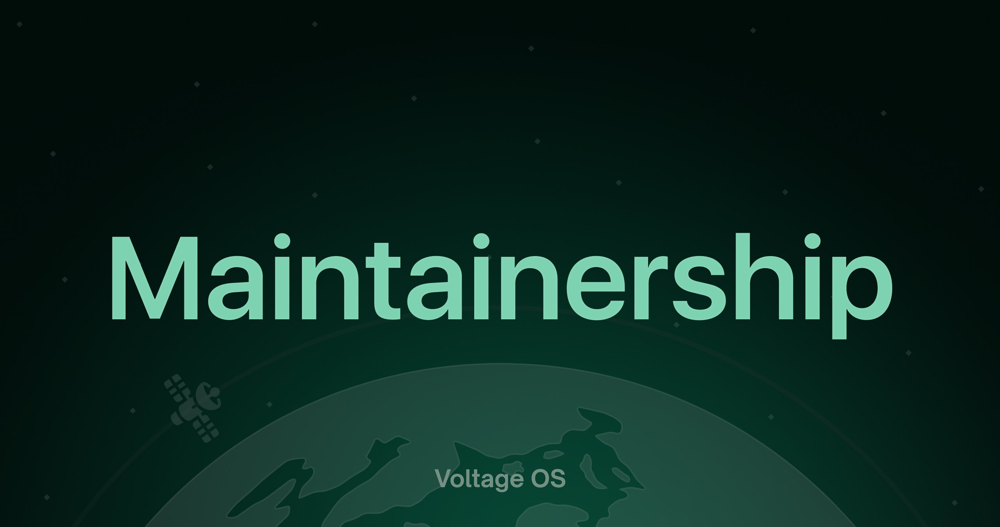

# ⚡ VoltageOS Official Devices

This repository is used **only for adding your device to official devices** in the VoltageOS project.  
If you want your device to become **officially supported**, please follow the process outlined below carefully.

---

## 🧩 Purpose
This repository serves as the **official registration point** for VoltageOS devices.  
All device requests are handled through GitHub **issues** using the provided template.

---

## 📝 Adding Your Device
To add your device to the official VoltageOS list:

1. Open a **new issue** using the **⚡ VoltageOS Maintainership** template.  
2. Fill in all required details accurately (device name, codename, sources, build info, maintainer details, etc.).  
3. Wait for a team member to review your submission.  
4. Once approved, your device will be added to the official roster and the maintainer invited to the organization.

---

## ✅ Requirements
Before submitting your device, make sure you meet the following:

- Prior experience in ROM building.
- Publicly available device sources (Device Tree, Kernel, Vendor) are preferred, but exceptions can be requested for private trees — see [Support Section](#%EF%B8%8F-support) for requesting exception.
- Active community presence and regular updates.
- You follow the VoltageOS [Code of Conduct](./code-of-conduct.md).

---

## 🤝 Maintainers Code of Conduct
All maintainers are expected to act professionally, communicate respectfully, and maintain transparency with the team.

> Violations of the Code of Conduct may result in removal from official maintainership.

Read the full [Code of Conduct](./code-of-conduct.md) before applying.

---

## 📦 Repository Structure
This repository contains:
- 🧾 **Issue template** for device addition requests
- 📚 **Documentation** for maintainers and submission rules

No source code or build files should ever be committed here.

---

## 🛠️ Support
If you have questions about the process or need help with your submission:
- Contact MrFox directly via [GitHub](https://github.com/mrfox2003) or [Telegram](https://t.me/mrfox2003)

---

## ⚡ Thank You
Thank you for contributing to VoltageOS and helping expand official device support.  
Your work keeps our community strong, stable, and open-source.

**The VoltageOS Team ⚡**
